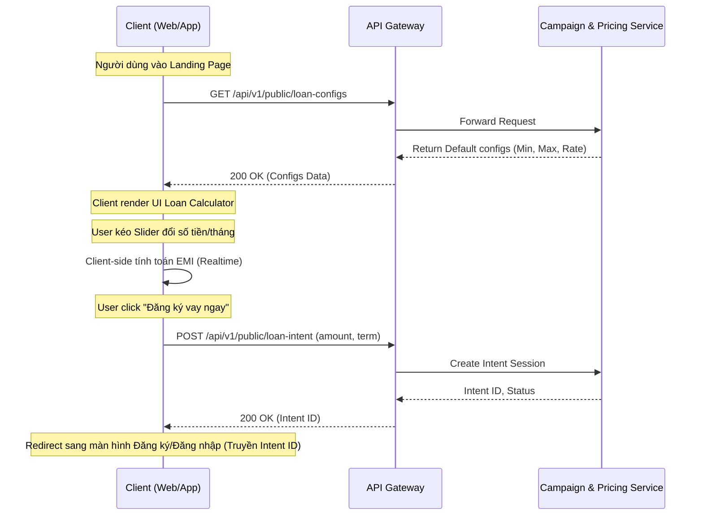
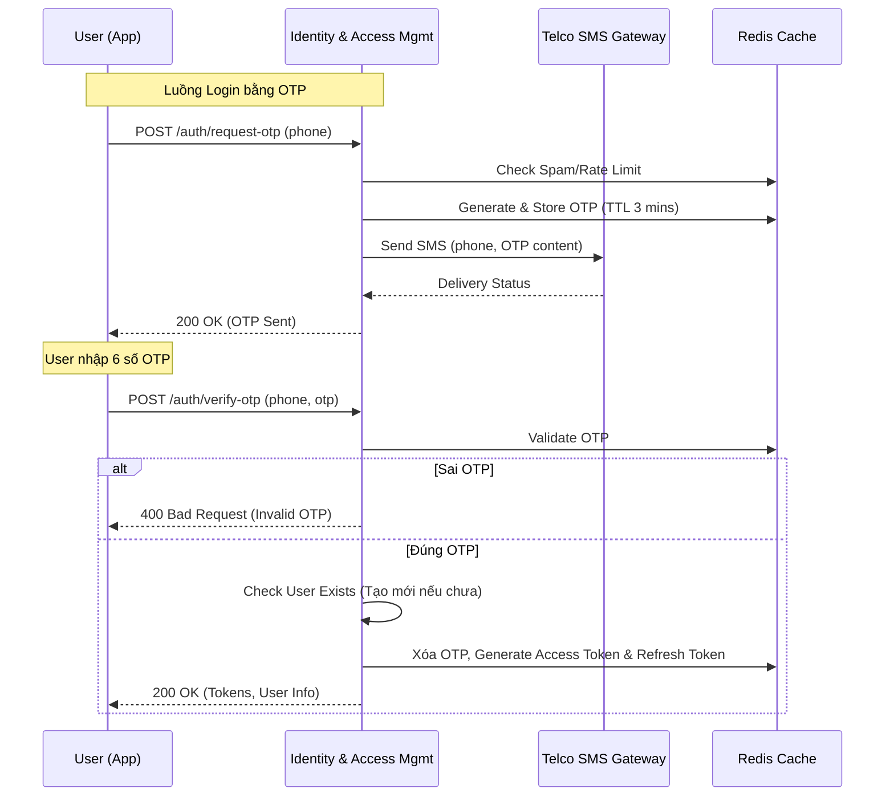

# TÀI LIỆU PHÂN TÍCH KỸ THUẬT (TECHNICAL SPECIFICATION)
**Dự án:** Hệ thống Hỗ trợ Vay Vốn (LOMS) - Kênh Khách hàng (Customer Portal / App)
**Ngày cập nhật:** 27/09/2026
**Trạng thái:** Draft

---

## CHỨC NĂNG 1: TRANG CHỦ / ĐĂNG KÝ KHOẢN VAY (LOAN CALCULATOR LANDING)

### A. Layout & UI/UX Specs

#### 1. Phân rã Component
- **Hero Banner:** Hình ảnh chất lượng cao, thông điệp marketing (Headline, Sub-headline).
- **Loan Calculator (Công cụ dự toán khoản vay - Thành phần chính):**
  - **Slider & Input Số tiền vay:** Dạng thanh kéo trượt ngang, kèm một Textbox để khách hàng có thể nhập số trực tiếp.
  - **Slider & Input Thời hạn vay:** Dạng thanh kéo trượt ngang, kèm Textbox hiển thị số tháng.
  - **Bảng tóm tắt dự toán (Estimation Card):** Hiển thị các thông tin: Lãi suất tham khảo (%), Tổng tiền lãi dự kiến, Số tiền trả góp hàng tháng (EMI).
  - **Nút CTA (Call-To-Action):** Nút "Đăng ký vay ngay" (Primary Button).

#### 2. Trạng thái UI (UI States)
- **Default:** Thanh slider nằm ở mức trung bình (Ví dụ: 30,000,000 VNĐ, 12 tháng). Button CTA ở trạng thái Active.
- **Focus/Active:** Khi click vào Input field, viền (border) chuyển màu Primary (Xanh dương), con trỏ nhấp nháy.
- **Error:** Nếu nhập sai định dạng ở Input (ví dụ chữ cái), text chuyển màu Đỏ, viền Đỏ, có tooltip báo lỗi.
- **Loading:** Khi người dùng thay đổi giá trị, hệ thống gọi API để lấy thông tin campaign (nếu có), icon spinner nhỏ xuất hiện góc khối tóm tắt. Nút CTA hiển thị "Đang xử lý..." kèm theo trạng thái Disabled.
- **Disabled:** Khi hệ thống đang tải hoặc đang bảo trì, nút CTA bị mờ (opacity 0.5) và không thể click.

#### 3. Responsive Behavior
- **Desktop (>= 1024px):** Layout chia 2 cột. Cột trái là Text/Banner marketing. Cột phải là khối Loan Calculator (Card nổi bật).
- **Tablet (768px - 1023px):** Layout 1 cột, Banner bên trên, Loan Calculator căn giữa, width 80%.
- **Mobile (< 768px):** Layout 1 cột, Loan Calculator chiếm 100% chiều rộng màn hình, sticky nút CTA dưới đáy màn hình (Bottom Sheet) khi cuộn trang để tối ưu chuyển đổi.

### B. Business Rules & Validation

#### 1. Quy tắc nghiệp vụ (Business Rules)
- **Số tiền vay (Loan Amount - `amount`):**
  - Min: 5,000,000 VND
  - Max: 100,000,000 VND
  - Step: 1,000,000 VND (Mỗi bước kéo slider tăng/giảm 1 triệu).
- **Thời hạn vay (Tenor - `term`):**
  - Min: 6 tháng
  - Max: 36 tháng
  - Step: 3 tháng (6, 9, 12, 15... 36).
- **Lãi suất (Interest Rate):**
  - Lãi suất hiển thị là **lãi suất tham khảo** (vd: 1.5%/tháng theo dư nợ giảm dần). Lãi suất thực tế phụ thuộc vào hồ sơ tín dụng (Credit Score) sau khi eKYC và chấm điểm.
- **Công thức tính trả góp đều hàng tháng (PMT/EMI):**
  - `P`: Số tiền gốc
  - `r`: Lãi suất tháng
  - `n`: Số tháng vay
  - `EMI = P * r * (1 + r)^n / ((1 + r)^n - 1)`
  - Kết quả hiển thị làm tròn đến hàng nghìn đồng.

#### 2. Data Validation
- Textbox `amount` và `term`: Chỉ cho phép nhập số (Regex: `^[0-9]+$`).
- Auto-correction (Tự động điều chỉnh): 
  - Nếu người dùng nhập tay vào input số tiền < 5,000,000, khi `onBlur` (rời khỏi ô text), tự động set về 5,000,000.
  - Nếu nhập > 100,000,000, tự động set về 100,000,000.
  - Tự động thêm dấu phẩy phân cách hàng nghìn (vd: 10,000,000) khi hiển thị.

### C. Sequence Diagram / Data Flow



### D. API Specifications

#### 1. API: Lấy cấu hình khoản vay
- **Method:** `GET`
- **Endpoint:** `/api/v1/public/loan-configs`
- **Request Payload:** None
- **Response Payload (Success - HTTP 200):**
```json
{
  "code": "00",
  "message": "Success",
  "data": {
    "minAmount": 5000000,
    "maxAmount": 100000000,
    "stepAmount": 1000000,
    "minTerm": 6,
    "maxTerm": 36,
    "stepTerm": 3,
    "baseInterestRate": 0.015,
    "currency": "VND"
  }
}
```

#### 2. API: Lưu thông tin dự định vay (Loan Intent)
- **Method:** `POST`
- **Endpoint:** `/api/v1/public/loan-intent`
- **Request Payload:**
```json
{
  "amount": 50000000,
  "term": 12,
  "source": "LANDING_PAGE",
  "deviceId": "uuid-1234-5678"
}
```
- **Response Payload (Success - HTTP 200):**
```json
{
  "code": "00",
  "message": "Success",
  "data": {
    "intentId": "INT-998877",
    "expiresAt": "2026-09-28T23:17:50+07:00"
  }
}
```

### E. Edge Cases & Exception Handling
1. **Lỗi mạng (Network Error / Timeout):**
   - API `loan-configs` timeout (> 5s).
   - *Xử lý:* Client sử dụng cache local (fallback data) để render màn hình tĩnh, hiển thị popup toast: "Kết nối mạng không ổn định, thông tin mang tính chất tham khảo".
2. **Nhập dữ liệu không hợp lệ bằng Auto-bot (XSS/SQLi injection):**
   - *Xử lý:* Middleware tại API Gateway (WAF) block các request có payload chứa ký tự đặc biệt. API trả về HTTP 400 Bad Request.

### F. Test Cases / Acceptance Criteria

| ID | Mô tả (Checklist AC) | Expected Result | Priority |
|---|---|---|---|
| TC_LC_01 | Kéo slider số tiền vay | Giá trị input thay đổi tương ứng, step 1M. Khối tính toán EMI tự động update kết quả. | High |
| TC_LC_02 | Nhập tay số tiền < 5,000,000 vào textbox | Khi blur, tự động convert thành 5,000,000. | High |
| TC_LC_03 | Nhập tay ký tự chữ/đặc biệt vào textbox | Không cho phép nhập, hệ thống chặn phím bấm không phải là số. | Medium |
| TC_LC_04 | Click "Đăng ký vay ngay" khi có mạng | API gọi thành công, điều hướng sang trang Login, lưu kèm IntentID trên URL/Session. | High |
| TC_LC_05 | Responsive trên màn hình Mobile (375x812) | Layout không bị vỡ, hiển thị 1 cột, nút CTA luôn nổi (sticky) ở dưới cùng. | High |

---

## CHỨC NĂNG 2: ĐĂNG KÝ / ĐĂNG NHẬP / XÁC THỰC OTP & BIOMETRICS

### A. Layout & UI/UX Specs

#### 1. Phân rã Component
- **Màn hình Nhập Số điện thoại (SĐT):**
  - Input field Số điện thoại (có prefix +84 hoặc cờ Việt Nam).
  - Nút CTA "Tiếp tục".
  - Link "Đăng nhập bằng Sinh trắc học" (Chỉ hiển thị trên App nếu thiết bị hỗ trợ & đã đăng ký trước đó).
- **Màn hình Xác thực OTP:**
  - Tiêu đề: "Nhập mã xác thực" kèm sub-text "Mã đã được gửi đến số ******789".
  - 6 ô input vuông cho 6 số OTP (Pin Code Input).
  - Nút/Link "Gửi lại mã (60s)" dạng đếm ngược.
- **Biometrics Prompt (Chỉ Mobile App):**
  - Bottom sheet của OS (iOS FaceID / Android Fingerprint/Face) popup lên yêu cầu xác thực.

#### 2. Trạng thái UI (UI States)
- **Input SĐT Focus:** Bàn phím số (Numpad) bật lên tự động (Mobile).
- **OTP Input Typing:** Tự động nhảy con trỏ sang ô tiếp theo sau khi nhập 1 số. Khi nhập đủ 6 số, tự động trigger action submit mà không cần bấm nút.
- **OTP Error:** Nếu sai mã, cả 6 ô viền Đỏ, rung nhẹ (shake animation) báo lỗi, text lỗi "Mã OTP không chính xác".
- **Countdown Timeout:** Khi đếm ngược OTP về 0, nút "Gửi lại mã" chuyển từ màu xám (Disabled) sang màu xanh (Active).

#### 3. Responsive Behavior
- Tương tự như chức năng 1, Mobile App sẽ tận dụng Numpad Keyboard, Desktop Web sẽ hỗ trợ paste clipboard cho OTP (tự động điền 6 số vào 6 ô).

### B. Business Rules & Validation

#### 1. Quy tắc Số điện thoại
- Định dạng: Các nhà mạng Việt Nam (Viettel, Vinaphone, Mobifone, Vietnamobile, Gmobile).
- Regex validation: `^(0|84)(3|5|7|8|9)[0-9]{8}$` (Tổng 10 số).
- Hệ thống không phân biệt Đăng ký hay Đăng nhập. Luồng duy nhất (Passwordless):
  - Nhập SĐT -> Gửi OTP -> Xác thực OTP.
  - Nếu SĐT chưa tồn tại -> Tạo mới (Đăng ký).
  - Nếu SĐT đã tồn tại -> Tạo phiên làm việc (Đăng nhập).

#### 2. Quy tắc OTP
- Độ dài: 6 chữ số.
- Thời gian hiệu lực (TTL): 3 phút (180 giây).
- Đếm ngược gửi lại: 60 giây.
- Khóa (Lock): Tối đa gửi OTP 5 lần/ngày/SĐT. Tối đa nhập sai OTP 5 lần/phiên. Nếu vi phạm, khóa SĐT trong 24 giờ.

#### 3. Quy tắc Biometrics (Sinh trắc học)
- Chỉ áp dụng đăng nhập cho Khách hàng đã có tài khoản và đã bật tính năng "Đăng nhập bằng Sinh trắc học" trong phần Cài đặt của App.
- Yêu cầu thiết bị có Hỗ trợ FaceID/TouchID (iOS) hoặc Biometric Prompt (Android).
- Khi xác thực Biometrics thành công, App sử dụng Refresh Token + JWT để gia hạn Session.

### C. Sequence Diagram / Data Flow



### D. API Specifications

#### 1. API: Yêu cầu gửi OTP
- **Method:** `POST`
- **Endpoint:** `/api/v1/auth/request-otp`
- **Request Payload:**
```json
{
  "phoneNumber": "0987654321",
  "deviceId": "uuid-1234-5678"
}
```
- **Response (Success - HTTP 200):**
```json
{
  "code": "00",
  "message": "OTP đã được gửi",
  "data": {
    "retryAfter": 60,
    "expiresIn": 180
  }
}
```
- **Response (Error - HTTP 429 Too Many Requests):**
```json
{
  "code": "ERR_AUTH_001",
  "message": "Bạn đã vượt quá số lần yêu cầu OTP trong ngày. Vui lòng thử lại sau 24h."
}
```

#### 2. API: Xác thực OTP & Đăng nhập
- **Method:** `POST`
- **Endpoint:** `/api/v1/auth/verify-otp`
- **Request Payload:**
```json
{
  "phoneNumber": "0987654321",
  "otp": "123456",
  "intentId": "INT-998877" 
}
```
*Note: intentId truyền vào (nếu có từ chức năng 1) để map khoản vay dự kiến vào tài khoản user.*

- **Response (Success - HTTP 200):**
```json
{
  "code": "00",
  "message": "Thành công",
  "data": {
    "accessToken": "eyJhbGciOiJIUzI1NiIsInR5...",
    "refreshToken": "def502003c27e8d3570624...",
    "expiresIn": 3600,
    "isNewUser": true,
    "userProfile": {
      "id": "USR-112233",
      "phone": "0987654321"
    }
  }
}
```

### E. Edge Cases & Exception Handling
1. **Spam OTP (Brute Force):**
   - *Case:* Khách hàng cố tình ấn nút gửi OTP liên tục hoặc dùng tool gọi API liên tục.
   - *Xử lý:* Redis rate limiter chặn ở API Gateway. Return HTTP 429 (Too Many Requests). UI hiển thị thông báo chặn 24h.
2. **Nhập sai OTP nhiều lần:**
   - *Case:* Kẻ gian đoán mã OTP.
   - *Xử lý:* Sai 5 lần -> Hủy phiên OTP hiện tại, return HTTP 403 Forbidden. Yêu cầu chờ lấy OTP mới.
3. **SMS Gateway Timeout / Mất mạng viễn thông:**
   - *Case:* Telco partner gặp sự cố, SMS không gửi tới điện thoại KH sau 60s.
   - *Xử lý:* Hỗ trợ fallback channel: Nút "Nhận cuộc gọi đọc OTP (Voice OTP)" hiện lên sau 60s đếm ngược.
4. **Biometrics thay đổi (Face/Fingerprint changed):**
   - *Case:* Khách hàng cài thêm khuôn mặt mới vào điện thoại. OS sẽ vô hiệu hóa khóa biometrics cũ trên App.
   - *Xử lý:* Bắt Exception `KeyPermanentlyInvalidatedException` ở Client, yêu cầu user Đăng nhập lại bằng OTP để kích hoạt lại Sinh trắc học.

### F. Test Cases / Acceptance Criteria

| ID | Mô tả (Checklist AC) | Expected Result | Priority |
|---|---|---|---|
| TC_AUTH_01 | Nhập SĐT không hợp lệ (9 số, 11 số, chứa chữ) | Nút "Tiếp tục" bị disable, hiển thị lỗi định dạng SĐT. | High |
| TC_AUTH_02 | Nhập SĐT hợp lệ và bấm "Tiếp tục" | Chuyển sang màn nhập OTP, nhận được SMS chứa mã 6 số. Bắt đầu đếm ngược 60s. | High |
| TC_AUTH_03 | Đợi hết 60s đếm ngược | Nút "Gửi lại mã" sáng lên, bấm vào nhận được SMS OTP mới. | High |
| TC_AUTH_04 | Nhập đúng OTP 6 số | Tự động submit API, đăng nhập thành công, chuyển tới Home Dashboard. | High |
| TC_AUTH_05 | Nhập sai OTP 5 lần liên tiếp | Báo lỗi, khóa tính năng nhập OTP của SĐT đó, yêu cầu thử lại sau. | High |
| TC_AUTH_06 | (Mobile) Copy OTP từ tin nhắn và paste | 6 số tự động điền vào 6 ô input vuông và submit thành công. | Medium |
| TC_AUTH_07 | Đăng nhập bằng Sinh trắc học thành công | Không cần OTP, verify face/finger, đăng nhập thành công. | High |
