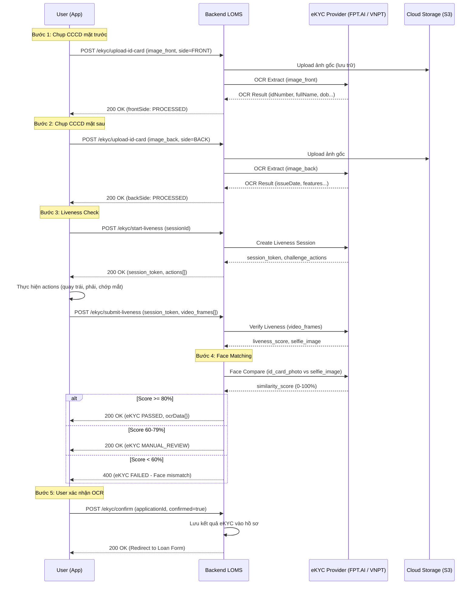

# TÀI LIỆU PHÂN TÍCH KỸ THUẬT - CHỨC NĂNG 3: XÁC THỰC DANH TÍNH ĐIỆN TỬ (eKYC)
**Dự án:** Hệ thống Hỗ trợ Vay Vốn (LOMS) - Kênh Khách hàng
**Ngày cập nhật:** 27/09/2026 | **Trạng thái:** Draft

---

## A. Layout & UI/UX Specs

### 1. Tổng quan luồng màn hình eKYC (4 sub-screens)

| Bước | Màn hình | Mô tả |
|---|---|---|
| 3.1 | Chụp CCCD Mặt trước | Camera overlay khung chữ nhật, auto-detect góc cạnh |
| 3.2 | Chụp CCCD Mặt sau | Tương tự 3.1, xử lý mặt sau |
| 3.3 | Quét khuôn mặt (Liveness) | Camera selfie, khung Oval, hướng dẫn hành động |
| 3.4 | Xác nhận thông tin OCR | Hiển thị dữ liệu trích xuất, cho phép xác nhận hoặc chụp lại |

### 2. Chi tiết từng màn hình

#### Màn hình 3.1 & 3.2: Chụp CCCD
- **Camera Viewport:** Full-screen camera view với overlay tối (semi-transparent black #000 opacity 60%).
- **Alignment Frame:** Khung chữ nhật tỷ lệ 85.6mm × 54mm (chuẩn ID card ISO/IEC 7810), viền trắng nét đứt 2px, bo góc 12px. Bên trong khung transparent để nhìn thấy camera.
- **Instruction Text:** Phía trên khung: "Đặt CCCD vào khung" (font 16px, semibold, white). Phía dưới khung: "Đảm bảo đủ sáng, không bị lóa" (font 13px, regular, white/70%).
- **Auto-capture indicator:** Khi hệ thống detect đủ 4 góc cạnh → khung viền chuyển từ trắng sang xanh lá (#10b981) → Tự động chụp sau 1s delay.
- **Nút chụp thủ công:** Nút tròn 64px ở giữa đáy màn hình (fallback nếu auto-capture không hoạt động).
- **Flash toggle:** Icon đèn flash góc trên phải.

#### Màn hình 3.3: Quét khuôn mặt (Liveness Check)
- **Camera Viewport:** Camera mặt trước (front-facing), full-screen.
- **Oval Frame:** Khung hình oval căn giữa màn hình, kích thước 250×320px (mobile).
- **Dynamic Instruction Text:** Text thay đổi theo từng action:
  - Bước 1: "Nhìn thẳng vào camera" → Check face detected
  - Bước 2: "Quay mặt sang trái" → Check left turn
  - Bước 3: "Quay mặt sang phải" → Check right turn  
  - Bước 4: "Chớp mắt" → Check blink
- **Progress dots:** 4 chấm tròn ở dưới oval, sáng lên khi hoàn thành mỗi bước.
- **Timer:** Đếm ngược 30 giây cho toàn bộ liveness session. Timeout → Retry.

#### Màn hình 3.4: Xác nhận thông tin OCR
- **Header Section:** Icon checkmark xanh lá + "Xác thực thành công" + % Face matching (VD: "Độ trùng khớp: 98.5%").
- **OCR Data Card:** Card trắng bo góc 12px, chứa các trường dữ liệu trích xuất dạng Read-only:
  - Họ và Tên | Số CCCD | Ngày sinh | Giới tính
  - Quê quán | Nơi thường trú | Ngày cấp | Có giá trị đến
- **Preview ảnh:** 2 thumbnail nhỏ (CCCD trước + sau) kèm 1 thumbnail selfie, có thể tap để xem full-screen.
- **Action Buttons:** "Chụp lại" (Secondary, outline) | "Xác nhận & Tiếp tục" (Primary, filled).

### 3. Trạng thái UI

| Trạng thái | Mô tả |
|---|---|
| **Default** | Camera view hiển thị, khung alignment trắng, chờ user đặt thẻ |
| **Detecting** | Hệ thống đang phát hiện cạnh thẻ → khung chuyển viền vàng + pulse animation |
| **Capturing** | Đã detect thành công → khung xanh lá → flash trắng (shutter effect) → chụp |
| **Processing** | Spinner overlay toàn màn hình + "Đang xử lý..." (gửi ảnh lên server) |
| **Success** | Chuyển sang màn hình tiếp theo (3.2 hoặc 3.3 hoặc 3.4) |
| **Error** | Popup bottom-sheet đỏ: "Ảnh không rõ nét, vui lòng chụp lại" + nút "Thử lại" |
| **Retry Limit** | Sau 5 lần thất bại → "Vui lòng liên hệ hỗ trợ" + nút "Gọi Hotline" |

---

## B. Business Rules & Validation

### 1. Quy tắc OCR - Trường bắt buộc trích xuất

| Trường | Field Key | Format | Validation |
|---|---|---|---|
| Số CCCD | `idNumber` | 12 chữ số | Regex: `^[0-9]{12}$` |
| Họ và Tên | `fullName` | Unicode text | Không rỗng, min 2 từ, max 50 ký tự |
| Ngày sinh | `dateOfBirth` | DD/MM/YYYY | Valid date, Tuổi >= 18 và <= 65 |
| Giới tính | `gender` | Nam/Nữ | Enum: `MALE`, `FEMALE` |
| Quê quán | `placeOfOrigin` | Text | Không rỗng |
| Nơi thường trú | `permanentAddress` | Text | Không rỗng |
| Ngày cấp | `issueDate` | DD/MM/YYYY | Valid date, < ngày hiện tại |
| Có giá trị đến | `expiryDate` | DD/MM/YYYY | Valid date, > ngày hiện tại (CCCD còn hạn) |

### 2. Quy tắc Face Matching
- **Threshold tối thiểu:** Similarity score >= **80%** → PASS.
- Similarity 60% - 79% → MANUAL_REVIEW (Chuyển thẩm định thủ công).
- Similarity < 60% → FAIL (Yêu cầu chụp lại hoặc từ chối).

### 3. Quy tắc Liveness Detection
- Phải hoàn thành 4 bước (nhìn thẳng, quay trái, quay phải, chớp mắt) trong 30 giây.
- Chống tấn công: Phát hiện ảnh in (print attack), video replay, deepfake mask.
- Confidence score liveness >= 90% → PASS.

### 4. Giới hạn Retry
- Chụp CCCD: Tối đa **5 lần** chụp lại / phiên.
- Liveness: Tối đa **3 lần** thực hiện / phiên.
- Sau khi hết retry → Khóa eKYC trong 24 giờ, yêu cầu liên hệ hotline.

### 5. Ràng buộc tuổi & hiệu lực CCCD
- Tuổi (tính từ `dateOfBirth`): **18 ≤ tuổi ≤ 65**. Ngoài khoảng → Auto-Reject.
- CCCD hết hạn (`expiryDate` < ngày hiện tại) → Từ chối, thông báo "CCCD đã hết hạn".

---

## C. Sequence Diagram / Data Flow



---

## D. API Specifications

### 1. Upload ảnh CCCD
- **Method:** `POST`
- **Endpoint:** `/api/v1/ekyc/upload-id-card`
- **Headers:** `Authorization: Bearer <token>`, `Content-Type: multipart/form-data`
- **Request Payload:**
```
FormData:
  image: <binary file> (JPG/PNG, max 10MB)
  side: "FRONT" | "BACK"
  applicationId: "APP-001122"
```
- **Response Success (HTTP 200):**
```json
{
  "code": "00",
  "message": "Thành công",
  "data": {
    "side": "FRONT",
    "status": "PROCESSED",
    "ocrResult": {
      "idNumber": "001099123456",
      "fullName": "NGUYEN VAN A",
      "dateOfBirth": "01/01/1999",
      "gender": "MALE",
      "placeOfOrigin": "Hà Nội",
      "permanentAddress": "123 Phố Huế, Hai Bà Trưng, Hà Nội",
      "issueDate": null,
      "expiryDate": null,
      "confidence": 0.95
    },
    "imageUrl": "https://storage.loms.vn/ekyc/APP-001122/front.jpg"
  }
}
```
- **Response Error (HTTP 400):**
```json
{
  "code": "ERR_EKYC_001",
  "message": "Ảnh không đạt chất lượng. Vui lòng chụp lại rõ nét hơn.",
  "data": { "reason": "BLURRY_IMAGE", "retryRemaining": 4 }
}
```

### 2. Bắt đầu phiên Liveness
- **Method:** `POST`
- **Endpoint:** `/api/v1/ekyc/start-liveness`
- **Request:**
```json
{
  "applicationId": "APP-001122",
  "deviceInfo": { "os": "iOS", "model": "iPhone 15", "appVersion": "2.1.0" }
}
```
- **Response Success (HTTP 200):**
```json
{
  "code": "00",
  "data": {
    "sessionToken": "LVS-abc123xyz",
    "expiresIn": 30,
    "challengeActions": ["LOOK_STRAIGHT", "TURN_LEFT", "TURN_RIGHT", "BLINK"]
  }
}
```

### 3. Submit kết quả Liveness & Face Match
- **Method:** `POST`
- **Endpoint:** `/api/v1/ekyc/submit-liveness`
- **Request:**
```
FormData:
  sessionToken: "LVS-abc123xyz"
  videoFrames: <binary[]> (hoặc short video clip)
```
- **Response Success (HTTP 200):**
```json
{
  "code": "00",
  "data": {
    "livenessScore": 97.2,
    "livenessResult": "PASS",
    "faceMatchScore": 98.5,
    "faceMatchResult": "PASS",
    "overallResult": "EKYC_PASSED"
  }
}
```
- **Response Error (HTTP 400):**
```json
{
  "code": "ERR_EKYC_003",
  "message": "Khuôn mặt không khớp với CCCD. Vui lòng thử lại.",
  "data": { "faceMatchScore": 45.2, "faceMatchResult": "FAIL", "retryRemaining": 2 }
}
```

### 4. Xác nhận kết quả eKYC
- **Method:** `POST`
- **Endpoint:** `/api/v1/ekyc/confirm`
- **Request:**
```json
{
  "applicationId": "APP-001122",
  "confirmed": true
}
```
- **Response Success (HTTP 200):**
```json
{
  "code": "00",
  "message": "Xác thực danh tính hoàn tất.",
  "data": { "nextStep": "LOAN_APPLICATION_FORM", "redirectUrl": "/apply/form" }
}
```

---

## E. Edge Cases & Exception Handling

| # | Tình huống | Cách xử lý |
|---|---|---|
| 1 | **Ảnh CCCD bị mờ/tối/lóa** | eKYC Provider trả `BLURRY_IMAGE`. UI hiển thị toast: "Ảnh không rõ nét" + nút "Chụp lại". Không tính vào retry limit nếu là lỗi chất lượng ảnh lần đầu. |
| 2 | **CCCD đã hết hạn** | OCR trích xuất `expiryDate` < today. Backend trả lỗi. UI: "CCCD đã hết hạn, vui lòng sử dụng CCCD còn hiệu lực." Chặn tiến trình. |
| 3 | **Tuổi < 18 hoặc > 65** | Tính từ `dateOfBirth`. Auto-reject. UI: "Rất tiếc, bạn chưa đủ điều kiện vay vốn." |
| 4 | **Face Matching < 60% (nghi ngờ giả mạo)** | Log security alert. Block user. UI: "Xác thực thất bại. Vui lòng liên hệ Hotline." Gửi alert cho Fraud team. |
| 5 | **Liveness timeout (> 30s)** | Session expired. UI: "Phiên xác thực đã hết hạn" + nút "Thử lại". Tạo session mới. |
| 6 | **Detect ảnh in / deepfake** | Liveness score < 50%. Log fraud event. Block device. UI thông báo chung (không tiết lộ lý do cụ thể để tránh gian lận học hỏi). |
| 7 | **Mất mạng giữa chừng (upload ảnh)** | Client retry tự động 3 lần (exponential backoff: 1s, 2s, 4s). Nếu fail → Offline toast + nút "Thử lại khi có mạng". Ảnh được lưu local tạm. |
| 8 | **eKYC Provider downtime** | Backend fallback: Queue request, retry sau 30s. Nếu vẫn fail → UI: "Hệ thống đang bảo trì, vui lòng quay lại sau." Lưu draft hồ sơ. |
| 9 | **OCR trích xuất sai thông tin** | Màn hình 3.4 cho phép user review. Nếu user báo sai → nút "Chụp lại" → Quay lại bước 3.1. Backend log OCR accuracy cho cải tiến model. |
| 10 | **CCCD loại cũ (9 số) hoặc CMND** | Regex validate `idNumber`. Nếu không phải 12 số → Từ chối. UI: "Hệ thống chỉ hỗ trợ CCCD gắn chip (12 số)." |

---

## F. Test Cases / Acceptance Criteria

| ID | Mô tả | Expected Result | Priority |
|---|---|---|---|
| TC_EKYC_01 | Chụp CCCD mặt trước trong điều kiện đủ sáng | Auto-detect cạnh thẻ, khung chuyển xanh, tự động chụp. OCR trả về đầy đủ thông tin. | High |
| TC_EKYC_02 | Chụp CCCD trong điều kiện thiếu sáng | Hệ thống báo lỗi "Ảnh không đạt chất lượng", yêu cầu chụp lại. | High |
| TC_EKYC_03 | Chụp CCCD đã hết hạn | Sau OCR, hệ thống phát hiện expiryDate < today, từ chối và thông báo rõ ràng. | High |
| TC_EKYC_04 | Liveness check hoàn thành đúng 4 actions | Liveness score >= 90%, kết quả PASS. Chuyển sang face matching. | High |
| TC_EKYC_05 | Liveness check timeout (không hoàn thành trong 30s) | Session expired, hiển thị thông báo + nút thử lại. | High |
| TC_EKYC_06 | Face matching score >= 80% | eKYC PASSED. Chuyển sang màn hình xác nhận OCR. | High |
| TC_EKYC_07 | Face matching score 60-79% | eKYC MANUAL_REVIEW. Thông báo "Hồ sơ cần xác minh thêm". | Medium |
| TC_EKYC_08 | Face matching score < 60% | eKYC FAILED. Thông báo lỗi, cho phép thử lại hoặc liên hệ hotline. | High |
| TC_EKYC_09 | Dùng ảnh in để qua liveness | Liveness detect "PRINT_ATTACK", score thấp, từ chối + log fraud. | Critical |
| TC_EKYC_10 | OCR trích xuất sai tên → User bấm "Chụp lại" | Quay lại bước chụp CCCD, không mất dữ liệu đã xác thực trước đó. | Medium |
| TC_EKYC_11 | Mất mạng khi đang upload ảnh CCCD | Auto-retry 3 lần. Nếu fail, hiển thị toast offline + lưu ảnh local. | High |
| TC_EKYC_12 | Thử chụp CCCD quá 5 lần liên tiếp (hết retry) | Khóa tính năng eKYC 24h, hiển thị "Liên hệ hotline hỗ trợ". | Medium |
| TC_EKYC_13 | Khách hàng dưới 18 tuổi (tính từ ngày sinh OCR) | Auto-reject ngay sau OCR, thông báo "Chưa đủ điều kiện". | High |
| TC_EKYC_14 | Nhập CMND cũ (9 số) thay vì CCCD (12 số) | Từ chối, thông báo "Chỉ hỗ trợ CCCD gắn chip 12 số". | Medium |
